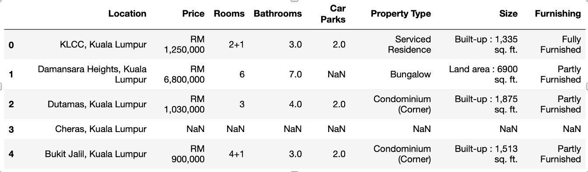

# Property Listings in Kuala Lumpur - Data Mining
In this project, property listings were data mined in the city of Kuala Lumpur, Malaysia. The main clusters were identified in an unsupervised way.

## Dataset
The dataset contains information relating to property for sale announcements in the city of Kuala Lumpur, Malaysia.
Each row represents an announcement relating to an apartment for sale.
For each ad there is information such as the place where the apartment is located, the price, the number of rooms and bathrooms, the number of car parks, the type of property, the size and the furnishings.
The dataset contains approximately 50,000 instances.

## Business Understanding
The business goal is to identify subgroups of similar properties in order to be able to meet the specific needs of a potential buyer.
Identify any frequent patterns of records in order to generate association rules between the various ad properties
It is therefore necessary to check for clusters within the dataset and to generate any association rules.

## Data Understanding
There are 8 features: 3 categorical features and 5 continuous features. 

1. Location (cat)
2. Property Type (cat)
3. Furnishing (cat)
4. Price (cont)
5. Rooms (cont)
6. Bathrooms (cont)
7. Car Parks (cont)
8. Size (cont)

## Initial Data

Some records are not in their correct format and any malformed values and null values will be handled.

## Preprocessing steps
### Price
- Deletion of the currency RM (Malaysian ringgit) from the field
- Deletion of the character «,» was carried out as it was not well interpreted by Weka being an integer value.

### Rooms
- Execution of any algebraic expressions n+m present in the field
- Special cases management
  - "Studio" was transformed to value 1
  - "20 Above" was transformed to value 20
The expression n+m, from the documentation, indicates n main rooms and m small rooms. The two values were added together to obtain a single room value.

### Size
- Division of the Size field into two new attributes: "Size Type" and "Size Num"
  -Size Type contains the type of size measurement performed.
  -Size Num contains the numeric value of the size.
- Execution of any nxm algebraic expressions present in the field

### Property Type
Presence of 96 types of properties that are very similar to each other
- Obtaining 10 main typologies that enclose the sub-typologies that are too specific for the purposes of the analysis.
- Creation of the Main Property Type field containing 10 macro-typologies

### Location
- Deleting substring ', Kuala Lumpur' from records as unnecessary

### Missing values
Missing values are present in almost all features, except in Location, Price and Property Type. The Car Parks attribute contains a large number of missing values which makes this field insignificant and problematic for analysis. The records of the remaining missing values can be deleted

- Clearing the missing value records of Size Type, Size Num, Rooms, Bathrooms
- Transforming the missing values of the Furnishing field into the value "Unknown"
- Deletion of the Car Parks field, because it is not very informative.
- Location values containing fewer than 100 properties were filtered out, as they did not correspond to real city neighborhoods

