# Property Listings in Kuala Lumpur - Data Mining
In this project, property listings were data mined in the city of Kuala Lumpur, Malaysia. The main clusters were identified in an unsupervised way.

## Dataset
The dataset contains information relating to property for sale announcements in the city of Kuala Lumpur, Malaysia.
Each row represents an announcement relating to an apartment for sale.
For each ad there is information such as the place where the apartment is located, the price, the number of rooms and bathrooms, the number of car parks, the type of property, the size and the furnishings.
The dataset contains approximately 50,000 instances.

## Business Understanding
The business goal is to identify subgroups of similar properties in order to be able to meet the specific needs of a potential buyer.
Identify any frequent patterns of records in order to generate association rules between the various ad properties
It is therefore necessary to check for clusters within the dataset and to generate any association rules.

## Data Understanding
There are 8 features: 3 categorical features and 5 continuous features. 

1. Location (cat)
2. Property Type (cat)
3. Furnishing (cat)
4. Price (cont)
5. Rooms (cont)
6. Bathrooms (cont)
7. Car Parks (cont)
8. Size (cont)

## Initial Data

Some records are not in their correct format and any malformed values and null values will be handled.

## Preprocessing steps
### Price
- Deletion of the currency RM (Malaysian ringgit) from the field
- Deletion of the character «,» was carried out as it was not well interpreted by Weka being an integer value.

### Rooms
- Execution of any algebraic expressions n+m present in the field
- Special cases management
  - "Studio" was transformed to value 1
  - "20 Above" was transformed to value 20
The expression n+m, from the documentation, indicates n main rooms and m small rooms. The two values were added together to obtain a single room value.

### Size
- Division of the Size field into two new attributes: "Size Type" and "Size Num"
  -Size Type contains the type of size measurement performed.
  -Size Num contains the numeric value of the size.
- Execution of any nxm algebraic expressions present in the field

### Property Type
Presence of 96 types of properties that are very similar to each other
- Obtaining 10 main typologies that enclose the sub-typologies that are too specific for the purposes of the analysis.
- Creation of the Main Property Type field containing 10 macro-typologies

### Location
- Deleting substring ', Kuala Lumpur' from records as unnecessary

### Missing values
Missing values are present in almost all features, except in Location, Price and Property Type. The Car Parks attribute contains a large number of missing values which makes this field insignificant and problematic for analysis. The records of the remaining missing values can be deleted

- Clearing the missing value records of Size Type, Size Num, Rooms, Bathrooms
- Transforming the missing values of the Furnishing field into the value "Unknown"
- Deletion of the Car Parks field, because it is not very informative
- Location values containing fewer than 100 properties were filtered out, as they did not correspond to real city neighborhoods

## Result dataset
The dataset obtained after preprocessing contains 49835 records and 8 features. 
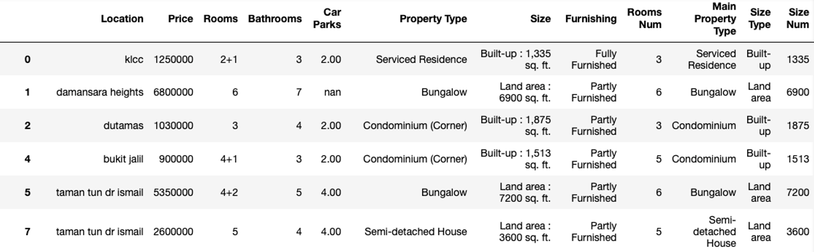

# Data Understanding
## Categorical features
The Location field still has a number of values greater than the real districts of the city. Different location values in which there are a negligible number of property listings. Mont Kiara and KLCC are the neighborhoods containing the most listings.

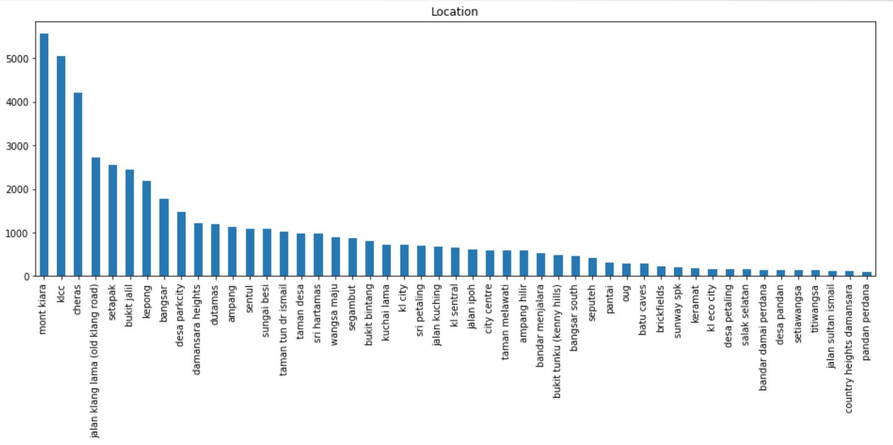

Condominium is the most common type of property among the records in the dataset. Most of the properties for sale have a built-up size typology. Most of the properties for sale are partially furnished.

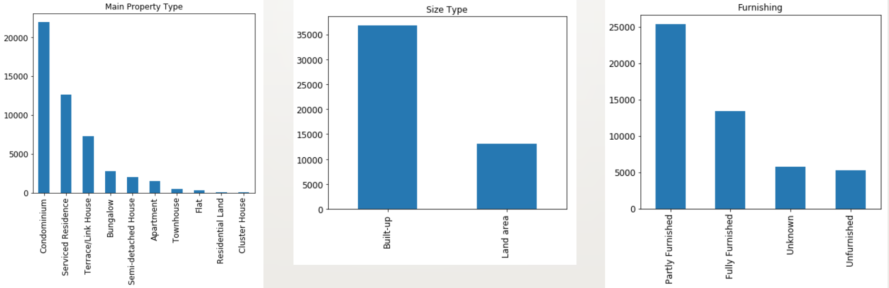

## Continuous features

Most properties contain 2 bathrooms and 3 bedrooms. Bathrooms and Rooms Num do not have particularly biased distributions. Price and Size Num, on the other hand, have distorted distributions, which makes their relative visualizations difficult to understand. Possible presence of outlier values in Price and Size Num which are extremely unusual to manage. 

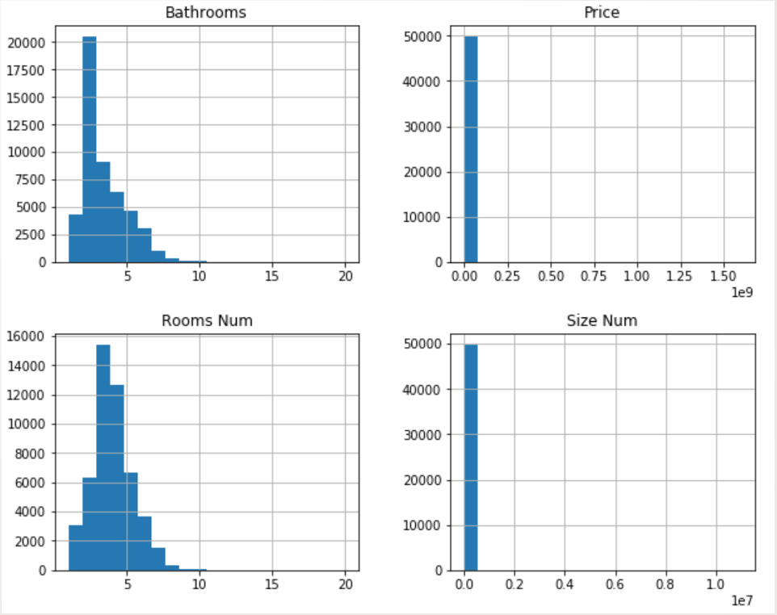

The Price and Size Num fields clearly have minimum and maximum values that are not possible within the domain.
Minimum price of RM308 and minimum size of 0 sqft.
Maximum price and maximum size equal to extremely high and infrequent values.

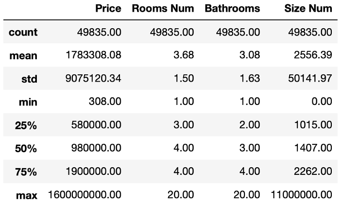

The exploratory analysis of the variables shows the presence of outliers in particular in the variables Price and Size Num.
We have chosen to consider the instances that exceed the limits of the minimum and maximum thresholds set in advance as outliers.
Number of records in the dataset equal to 48,978.

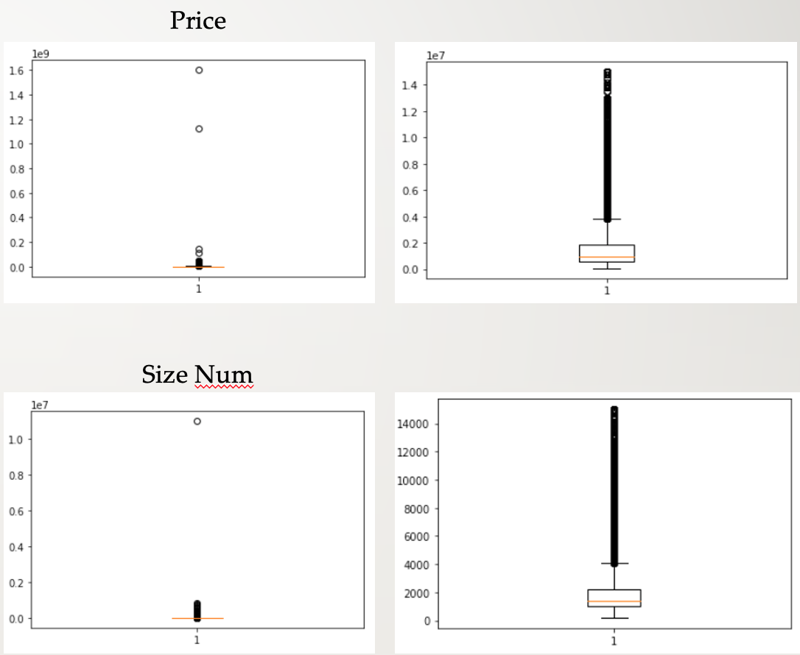

# Clustering

## K-means

The K-means algorithm was applied to search for any clusters within the data.
By analyzing the results for different values of k, no particularly interesting results were obtained.
For k=5 very confused clusters are obtained as the algorithm is not able to discriminate well the various subgroups of properties.
Euclidean distance was used as a measure of distance
Sum of squared errors: 64979.11
Possible problem: presence of variables of categorical type

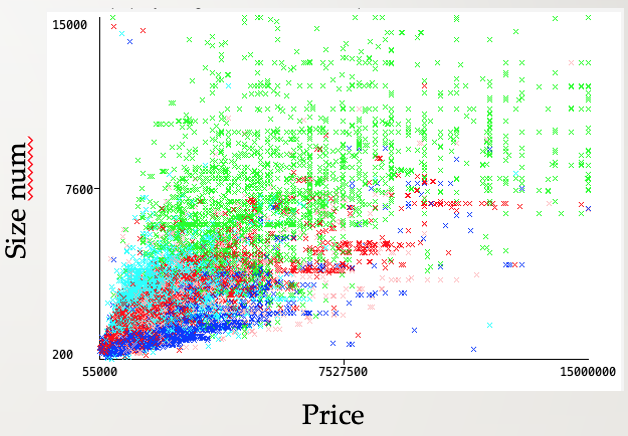

Ignoring the categorical variables and taking into consideration only Price, Rooms Num, Bathrooms and Size Num different results are obtained.
By selecting a number of clusters k=6 as an algorithm parameter, higher quality clusters are obtained. Sum of squared errors: 368.59. The 6 clusters found by the algorithm have the following centroids. A Euclidean distance function was used with a seed=10 value.

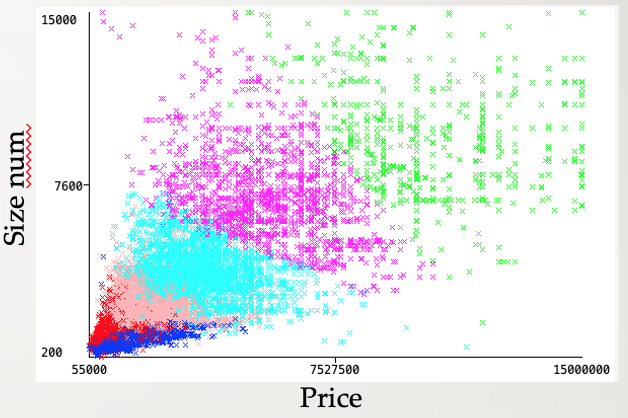

- Cluster 0: small properties with a minimum number of rooms and bathrooms and a medium-low price.
- Cluster 1: very cheap properties but with a greater size and number of rooms and bathrooms.
- Cluster 2: Most expensive and largest properties in the dataset
- Cluster 3: properties with a medium-high price and a medium-high size value with over 5 bedrooms and bathrooms.
- Cluster 4: most common properties with an average price and size.
- Cluster 5: expensive properties with more than 6 rooms and 5 bathrooms, but with a structure size smaller than cluster 2.

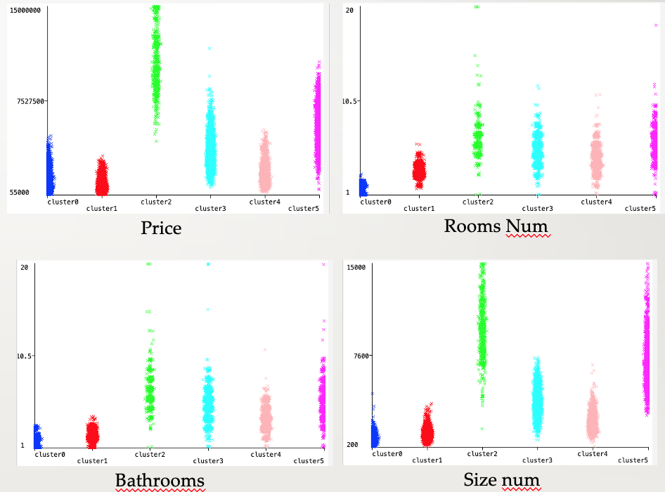

## Expectation-maximization 
Using the EM (Expectation-Maximization) algorithm and taking into consideration all the attributes of the dataset (even the categorical ones), different results are obtained from the K-means algorithm. By not specifying the number of clusters to generate, k=7 clusters are obtained, a number similar to that specified in the K-means algorithm. The log of likelihood obtained is -30.68. By inserting a number of k equal to 6 as a parameter in the algorithm, a log likelihood value equal to -29.87 is obtained, preferable with respect to the previous one, as it is a value to be maximized.

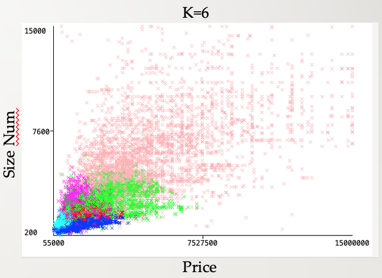

Although the EM algorithm can distinguish clusters in properties having similar characteristics, it has some problems with some attributes.
Along the feature Price, the clusters 0,1,5 cannot be discriminated optimally.
The properties belonging to cluster 4 are not easy to interpret as they are distributed along the entire range of fields, in particular in Price and Size Num.

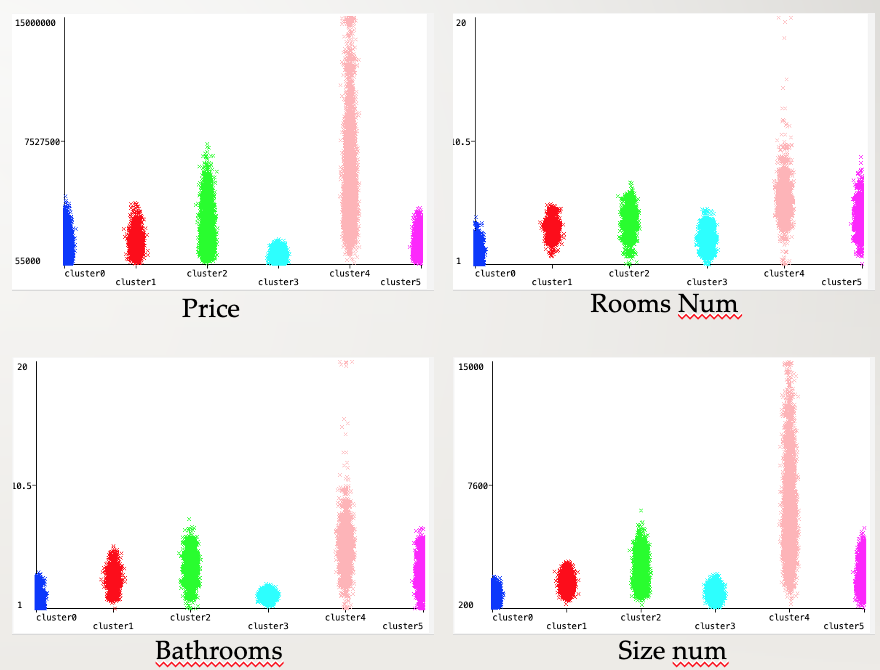

## Cluster validation

The validation phase of the clustering performed is particularly complex in this case since it is an unsupervised problem. In fact, there is no external validation criterion, as there is no class variable that can evaluate the quality of the clusters created.
It is therefore necessary to use internal validation criteria, considering however that these criteria will favor the clustering algorithm that uses a similar type of objective function for its optimization. In this case it is not optimal to make a comparison between clustering algorithms that are based on different methodologies, such as K-means and EM. In this case, the internal criterion based on the sum of the quadratic distances from the centroids (SSQ) was used to determine the best number of clusters to create through the K-means algorithm.

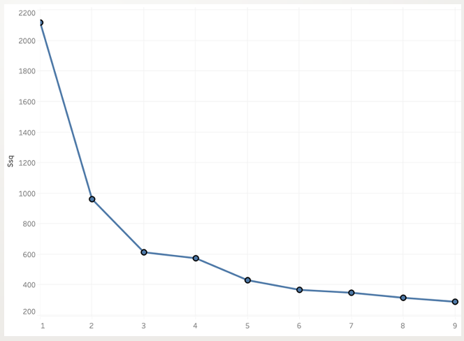

From the following graph it is possible to notice an inflection point with a number k=3
However the SSQ value continues to decrease up to a value of k=6, which corresponds to the number of clusters previously used.

